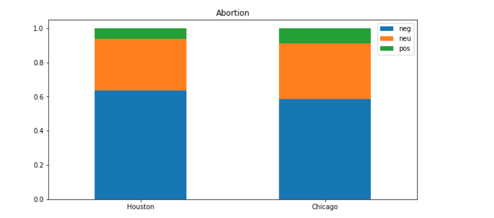

# General Description of the Project

The purpose of this project is to scrape tweets from Twitter using Twitter API on a selected topic (e.g., Barack Obama, WWE Raw) for a given US city (e.g., New York, Washington DC), and run Sentiment Analysis, a Natural Language Processing (NLP) tool on the scraped data. Sentiment Analysis is used to “systematically identify, extract, quantify, and study affective states and subjective information” (Wikipedia contributors, 2022f). 
The program does the search based on key word (topic), location (a US city) and time. Currently, the time is set to scrape all the tweets about the key word from the location from the first mention of the key word in that city until the current time. The output is saved in csv files with the search key word and location, which makes it easier to identify the queries. All the csv files are then sent to the Sentiment Analysis program, which runs the analysis on every tweet file and returns positive, negative and neutral sentiments for the data. The results of the analysis is then used to create bar and stack charts using the Pyhton library Pandas. 

# Requirements

Twitter API keys are required for this project. They can be acquired through opening up a Twitter Developer Account in this link: [Developer Account] (https://developer.twitter.com/en/apply-for-access) and applying for a project. With the academic research option, it is possible to scrape up to 10 million tweets a month.  

Run this in your terminal before you run the Sentiment Analysis: !pip install transformers

Here is the list of libraries for this project:
* Tweepy
* Time
* Datetime
* Pandas
* Pytz
* Re
* Transformers
* Scipy.special

# How the program works

What topic are you most curious about? Are you wondering what Twitter users are saying about it in your hometown? In the capital city of your state? Or the biggest US cities? All of these questions can be answered with this program!

Firstly, go to the main.py and enter your Client key in the following code: client = tweepy.Client("your key").

Then, change the following code with your topic and city to run a query: 

df = tweets_to_csv("Abortion", "Houston")

Make sure to change only the information inside the quotation marks!

The query date is set to start with 2006, when Twitter was created and the current time. But you can change it if you want to!

To change the start time, go to the following code in the main.py:
start_time = datetime(2006, 7, 1, 0, 0, 0, 0) 
and change the date from 2006 to any time!

The rest of the program will run the Sentiment Analysis using your chosen topic and city (or cities)
Example:
keyword = "Abortion"
cities = ["Houston", "Chicago"] 

After the Sentiment Analysis is completed, you can even create cool bar charts like the following, using the following code:

df = pd.DataFrame(data=data, index=cities)
df.plot.bar(rot=0, subplots=True, figsize=(5, 10), legend=False);

