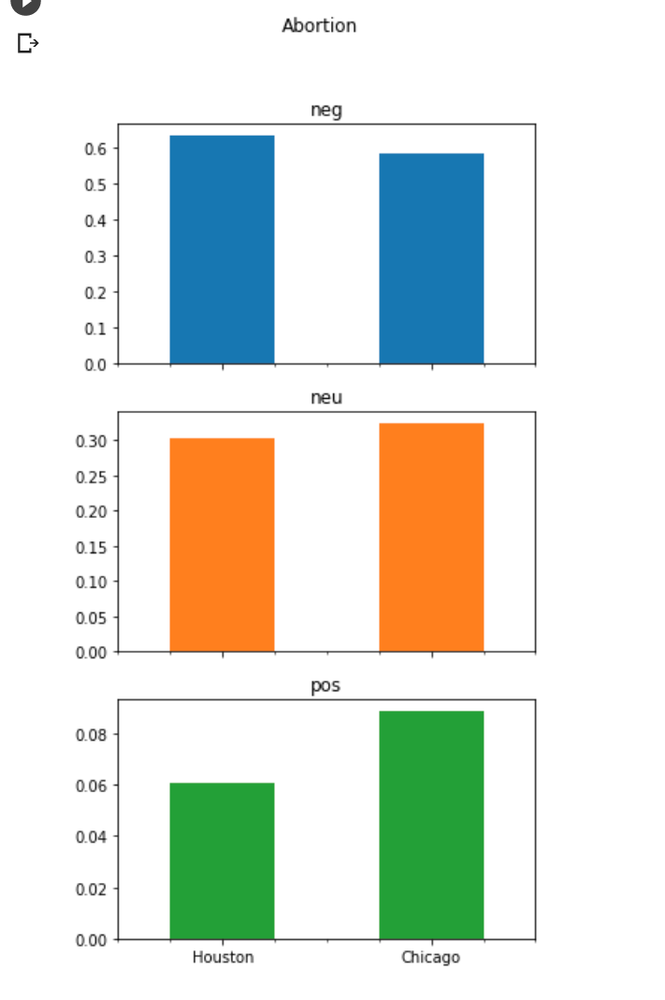

# General Description of the Project

The purpose of this project is to scrape tweets from Twitter using Twitter API on a selected topic (e.g., Barack Obama, WWE Raw) for a given US city (e.g., New York, Washington DC), and run Sentiment Analysis, a Natural Language Processing (NLP) tool on the scraped data. Sentiment Analysis is used to “systematically identify, extract, quantify, and study affective states and subjective information” (Wikipedia contributors, 2022f). 
The program does the search based on key word (topic), location (a US city) and time. Currently, the time is set to scrape all the tweets about the key word from the location from the first mention of the key word in that city until the current time. The output is saved in csv files with the search key word and location, which makes it easier to identify the queries. All the csv files are then sent to the Sentiment Analysis program, which runs the analysis on every tweet file and returns positive, negative and neutral sentiments for the data. The results of the analysis is then used to create bar and stack charts using the Pyhton library Pandas. 

# Requirements

Twitter API keys are required for this project. They can be acquired through opening up a Twitter Developer Account in this link: [Developer Account] (https://developer.twitter.com/en/apply-for-access) and applying for a project. With the academic research option, it is possible to scrape up to 10 million tweets a month.  

Here is the list of libraries for this project:
•	Tweepy
•	Time
•	Datetime
•	Pandas
•	Pytz
•	Re
•	Transformers
•	Scipy.special

# Technical Flow

The tweets_to_csv() function is set to receive a keyword (your chosen topic) and city (from US) as the input and the output is converted to a data frame and saved as a csv file, with the file name as the key word + location, using the Pandas library.

The clean() function takes text as the parameter and cleans the files of all characters that are not as part of the text (the actual tweet). It uses Re library. 

Single city or a batch of cities could be queried, depending on the purpose of the programmer/user.

Sentiment Analysis is run with the run_sentiment_analyzer() function on the csv file(s) with trained data from the Roberta model, using AutoTokenizer as the tokenizer and AutoModelForSequenceClassification as the model.

Using the Pandas library, columns are created for making the data frame later on as an empty list to hold the negative, positive and neutral values from the Sentiment Analysis. This is held inside a dictionary with the keys as the sentiment analysis values and empty list for each key as the value.

The next step is data visualization. Using the Pandas library, bar charts are created.

